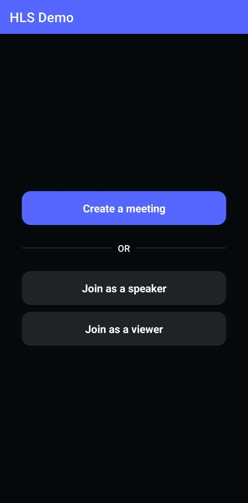
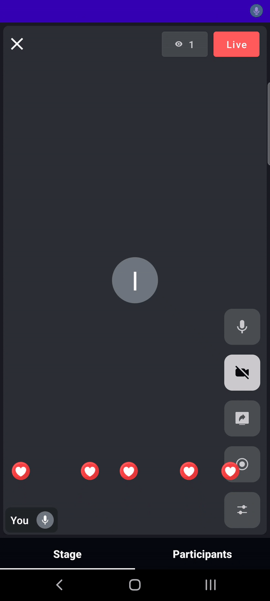

<p align="center">

</p>

---

[](https://docs.videosdk.live/android/guide/video-and-audio-calling-api-sdk/getting-started)
[](https://appdistribution.firebase.dev/i/99ae2c5db3a7e446)
[](https://discord.gg/bGZtAbwvab)
[](https://app.videosdk.live/signup)

## Demo App

📱 Download the sample Android app here: https://appdistribution.firebase.dev/i/a8156572b0936799

At Video SDK, we’re building tools to help companies create world-class collaborative products with capabilities of live audio/videos, compose cloud recordings/rtmp/hls and interaction APIs.

## Interactive Livestream (HLS)
    
- Interactive live stream (HLS) is a media streaming protocol for delivering visual and audio media to viewers over the internet.
- Interactive live stream (HLS) allows you to distribute content and ensure excellent viewing experiences across devices, playback platforms, and network conditions. It is the ideal protocol for streaming video to large audiences scattered across geographies.

<p align="center">

</p>

- VideoSDK also allows you to configure the interactive livestream layouts in numerous ways like by simply setting different prebuilt layouts in the configuration or by providing your own [custom template](https://docs.videosdk.live/docs/tutorials/customized-layout) to do the livestream according to your layout choice.

<br/>

> **Note** :
>
> With VideoSDK, you can also use your own custom designed layout template to livestream the meetings. In order to use the custom template, you need to create a template for which you can [follow these guide](https://docs.videosdk.live/docs/tutorials/customized-layout). Once you have setup the template, you can use the [REST API to start](https://docs.videosdk.live/api-reference/realtime-communication/start-hlsStream) the livestream with the `templateURL` parameter.

<br/>

## Setup Guide
- Sign up on [VideoSDK](https://app.videosdk.live) and visit [API Keys](https://app.videosdk.live/api-keys) section to get your API key and Secret key.

- Get familiarized with [API key and Secret key](https://docs.videosdk.live/android/guide/video-and-audio-calling-api-sdk/signup-and-create-api).

- Get familiarized with [Token](https://docs.videosdk.live/android/guide/video-and-audio-calling-api-sdk/server-setup).

<br/>

## Prerequisites
- Development environment requirements:
  - [Java Development Kit](https://www.oracle.com/java/technologies/downloads/)
  - Android Studio 3.0 or later
- A physical or virtual mobile device running Android 5.0 or later
- Valid [Video SDK Account](https://app.videosdk.live/)

<br/>

## Run the Sample Project
### 1. Clone the sample project

Clone the repository to your local environment.

```js
git clone https://github.com/videosdk-live/videosdk-hls-android-kotlin-example.git
```

### 2. Modify local.properties

Generate temporary token from [Video SDK Account](https://app.videosdk.live/signup).

```js title="local.properties"
auth_token = "TEMPORARY-TOKEN";
```

### 3. Run the sample app

Run the android app with **Shift+F10** or the **▶ Run** from toolbar.

<br/>

## Key Concepts

- `Meeting` - A Meeting represents Real time audio and video communication.

  **`Note : Don't confuse with Room and Meeting keyword, both are same thing 😃`**

- `Sessions` - A particular duration you spend in a given meeting is a referred as session, you can
  have multiple session of a particular meetingId.
- `Participant` - Participant represents someone who is attending the meeting's
  session, `local partcipant` represents self (You), for this self, other participants
  are `remote participants`.
- `Stream` - Stream means video or audio media content that is either published
  by `local participant` or `remote participants`.
- `Mode` - There are 2 types of modes:
    1. `CONFERENCE`: Both audio and video streams will be produced and consumed in this mode.
    2. `VIEWER`: Audio and video streams will not be produced or consumed in this mode.

<br/>

## Android Permission

Add all the following permissions to AndroidManifest.xml file.

```
    <uses-permission android:name="android.permission.RECORD_AUDIO" />
    <uses-permission android:name="android.permission.INTERNET" />
    <uses-permission android:name="android.permission.CAMERA" />
    <uses-permission android:name="android.permission.BLUETOOTH" />
    <uses-permission android:name="android.permission.BLUETOOTH_ADMIN" />
    <uses-permission android:name="android.permission.BLUETOOTH_CONNECT" />
```

<br/>

## Token Generation
Token is used to create and validate a meeting using API and also initialise a meeting.

🛠️ `Development Environment`:

- For development, you can use temporary token. Visit VideoSDK [dashboard](https://app.videosdk.live/api-keys) to generate temporary token.

🌐 `Production Environment`:

- For production, you have to set up an authentication server to authorize users. Follow our official example repositories to setup authentication server, [videosdk-rtc-api-server-examples](https://github.com/videosdk-live/videosdk-rtc-api-server-examples)

<br/>

## API: Create and Validate meeting
- `create meeting` - Please refer this [documentation](https://docs.videosdk.live/api-reference/realtime-communication/create-room) to create meeting.
- `validate meeting`- Please refer this [documentation](https://docs.videosdk.live/api-reference/realtime-communication/validate-room) to validate the meetingId.

<br/>

## [Initialize a Meeting](https://docs.videosdk.live/android/api/sdk-reference/initMeeting)
1. For meeting initialization, you have to first initialize the `VideoSDK`. You can initialize the `VideoSDK` using `initialize()` method.

```js
  VideoSDK.initialize(context: Context)
```

2. After successfully initialization, you can configure `VideoSDK` by passing token in `config` method

```js
  VideoSDK.config(token: String?)
```

3. After VideoSDK initialization and configuration, you can initialize the meeting using `initMeeting()` method. `initMeeting()` will generate a new `Meeting` class and the initiated meeting will be returned.

```js
 val meeting: Meeting? = VideoSDK.initMeeting(
                            context: Context?,
                            meetingId: String?,
                            name: String?,
                            micEnabled: Boolean,
                            webcamEnabled: Boolean,
                            participantId: String?,
                            mode: String?,
                            customTracks: Map<String?, CustomStreamTrack?>?
                        )
```

## [Join Meeting](https://docs.videosdk.live/android/guide/video-and-audio-calling-api-sdk/features/start-join-meeting)
```js
meeting!!.join()
```

## [Leave or End Meeting](https://docs.videosdk.live/android/guide/video-and-audio-calling-api-sdk/features/leave-end-meeting)
```js
// Only one participant will leave/exit the meeting; the rest of the participants will remain.
meeting!!.leave();

// The meeting will come to an end for each and every participant. So, use this function in accordance with your requirements.
meeting!!.end();
```

## [Change Mode]()

- If you want to change the mode of a participant, use the meeting's `changeMode()` method.

```js
meeting!!.changeMode(mode: String?)
```

## [Setup MeetingEventListener](https://docs.videosdk.live/android/api/sdk-reference/meeting-class/meeting-event-listener-class)
By implementing `MeetingEventListener`, VideoSDK sends callbacks to the client app whenever there is a change or update in the meeting after a user joins.

```js
  val meetingEventListener: MeetingEventListener = object : MeetingEventListener() {
        
        override fun onMeetingJoined() {
           // This event will be emitted when a localParticipant(you) successfully joined the meeting.
        }

        override fun onMeetingLeft() {
           // This event will be emitted when a localParticipant(you) left the meeting.
        }

        override fun onParticipantJoined(participant: Participant) {
           // This event will be emitted when a new participant joined the meeting.
           // [participant]: new participant who joined the meeting
        }

        override fun onParticipantLeft(participant: Participant) {
           // This event will be emitted when a joined participant left the meeting.
           // [participant]: participant who left the meeting
        }
        
        override fun onHlsStateChanged(HlsState: JSONObject) {
           // This event will be emitted whenever meeting HLS state changes.
           // [HlsState] : state of HLS
        }
        
        override fun onParticipantModeChanged(data: JSONObject) {
           // This event will be emitted when any partcipant's mode changed.
           // [data] : { mode: String, participantId: String }
        }
        
        override fun onPresenterChanged(participantId: String?) {
           // This event will be emitted when any participant starts or stops screen sharing.
           // [participantId]: Id of participant who shares the screen.
        }

        override fun onSpeakerChanged(participantId: String?) {
           // This event will be emitted when a active speaker changed.
           // [participantId] : Id of active speaker
        }

        override fun onRecordingStateChanged(recordingState: JSONObject) {
           // This event will be emitted whenever meeting recording state changes.
           // [recordingState] : state of meeting recording
        }
    };
```

<br/>

## Event associated with HLS

- **onHlsStateChanged** - Whenever meeting HLS state changes, then `onHlsStateChanged` event will trigger.

- You can get the **`downstreamUrl`** of the HLS to play it on the Viewer side when the state changes to **`HLS_PLAYABLE`**.

```js
private val meetingEventListener: MeetingEventListener = object : MeetingEventListener() {

  override fun onHlsStateChanged(HlsState: JSONObject) {
    when (HlsState.getString("status")) {
        "HLS_STARTING" -> Log.d("onHlsStateChanged", "Meeting hls is starting")
        "HLS_STARTED" -> Log.d("onHlsStateChanged", "Meeting hls is started")
        "HLS_PLAYABLE" -> {
            Log.d("onHlsStateChanged", "Meeting hls is playable now")
            // on hls playable you will receive downstreamUrl
            val downStreamUrl = HlsState.getString("downstreamUrl")
        }
        "HLS_STOPPING" -> Log.d("onHlsStateChanged", "Meeting hls is stopping")
        "HLS_STOPPED" -> Log.d("onHlsStateChanged", "Meeting hls is stopped")
    }
  }
  
}
```


## Methods and Listeners for Conference(Speaker) mode

## [Mute/Unmute Local Audio](https://docs.videosdk.live/android/guide/video-and-audio-calling-api-sdk/features/mic-controls)
```js
// unmute mic
meeting!!.unmuteMic()

// mute mic
meeting!!.muteMic()
```

## [Change Audio Device](https://docs.videosdk.live/android/guide/video-and-audio-calling-api-sdk/features/mic-controls#2-change-audio-device)
- The meeting.mics function allows a participant to list all of the attached microphones (e.g., Bluetooth and Earphone).

```js
 // get connected mics
 val mics= meeting!!.mics
```

- Local participant can change the audio device using changeMic(device: AudioDevice?) method of meeting class.

```js
// change mic
meeting!!.changeMic(device: AudioDevice?) 
```

Please consult our documentation [Change Audio Device](https://docs.videosdk.live/android/guide/video-and-audio-calling-api-sdk/features/mic-controls#2-change-audio-device) for more infromation.


## [Enable/Disable Local Webcam](https://docs.videosdk.live/android/guide/video-and-audio-calling-api-sdk/features/camera-controls)
```js
// enable webcam
meeting!!.enableWebcam()

// disable webcam
meeting!!.disableWebcam()
```

## [Switch Local Webcam](https://docs.videosdk.live/android/guide/video-and-audio-calling-api-sdk/features/camera-controls)
```js
// switch webcam
meeting!!.changeWebcam()
```

## [Start/Stop HLS]()
```js
// start HLS
meeting!!.startHls(config: JSONObject?);

// stop HLS
meeting!!.stopHls();
```

## [Pin/Unpin Participant]()
```js
// pin local participant
meeting!!.getLocalParticipant().pin(type: String?);

// unpin local participant
meeting!!.getLocalParticipant().unpin(type: String?);
```

## [Setup ParticipantEventListener](https://docs.videosdk.live/android/api/sdk-reference/participant-class/participant-event-listener-class)
By implementing `ParticipantEventListener`, VideoSDK sends callbacks to the client app whenever a participant's video, audio, or screen share stream is enabled or disabled.

```js
 val participantEventListener: ParticipantEventListener = object : ParticipantEventListener() {
       override fun onStreamEnabled(stream: Stream) {
          // This event will be triggered whenever a participant's video, audio or screen share stream is enabled.
       }

       override fun onStreamDisabled(stream: Stream) {
          // This event will be triggered whenever a participant's video, audio or screen share stream is disabled.
       }
   }

```

If you want to learn more about, read the complete documentation of [Android VideoSDK](https://docs.videosdk.live/android/guide/video-and-audio-calling-api-sdk/getting-started)

<br/>

## HLS Player

- Here, we're using `ExoPlayer` to show the viewer interactive live streaming. [Click here](https://github.com/google/ExoPlayer) to know more about `ExoPlayer`.

<br/>

## Project Structure
We have 3 packages :

1. [`common`](app/src/main/java/live/videosdk/android/hlsdemo/common) - common package includes all classes/files that are used in both mode.
2. [`speakerMode`](app/src/main/java/live/videosdk/android/hlsdemo/speakerMode) - speakerMode package includes all classes/files related to `CONFERENCE`  mode(speaker).
3. [`viewerMode`](app/src/main/java/live/videosdk/android/hlsdemo/viewerMode) - viewerMode package inclues all the classes/files related to `VIEWER`  mode.

<br/>

### [common package](app/src/main/java/live/videosdk/android/hlsdemo/common)

```
common
└── meeting
└── reactions
```

**1. Create or Join Meeting**

```
common
└── meeting
    └── activity
      └── CreateOrJoinActivity.kt
      └── MainActivity.kt
    └── fragment
      └── CreateOrJoinFragment.kt
      └── CreateMeetingFragment.kt
      └── JoinMeetingFragment.kt
```
- [`CreateOrJoinActivity.kt`](app/src/main/java/live/videosdk/android/hlsdemo/common/meeting/activity/CreateOrJoinActivity.kt) and [`activity_create_or_join.xml`](app/src/main/res/layout/activity_create_or_join.xml)
  - This activity is used to ask permissions to the partcipant,and to initiate webcam and mic status.
  - `CreateOrJoinFragment`,`CreateMeetingFragment`,`JoinMeetingFragment` will be bound to this activity.
  
- [`CreateOrJoinFragment.kt`](app/src/main/java/live/videosdk/android/hlsdemo/common/meeting/fragment/CreateOrJoinFragment.kt) and [`fragment_create_or_join.xml`](app/src/main/res/layout/fragment_create_or_join.xml) - This fragment will include
  - `Create meeting Button` - This button will call api for create a new meeting and navigate to `CreateMeetingFragment`.
  - `Join as speaker Button` - This button will navigate to `JoinMeetingFragment`.
  - `Join as viewer Button` - This button will navigate to `JoinMeetingFragment`.
  <p align="center">
  
  </p>
- [`CreateMeetingFragment.kt`](app/src/main/java/live/videosdk/android/hlsdemo/common/meeting/fragment/CreateMeetingFragment.kt) and [`fragment_create_meeting.xml`](app/src/main/res/layout/fragment_create_meeting.xml) -  This fragement will include
  - `TextView for MeetingId` - This textView will contain meeting Id.
  - `EditText for ParticipantName` - This edit text will contain name of the participant.
  - `Create Meeting Button` - This button will navigate to `MainActivity`.
  <p align="center">
  
  </p>
- [`JoinMeetingFragment.kt`](app/src/main/java/live/videosdk/android/hlsdemo/common/meeting/fragment/JoinMeetingFragment.kt) and [`fragment_join_meeting.xml`](app/src/main/res/layout/fragment_join_meeting.xml) - This fragement will include
  - `EditText for MeetingId` - This edit text will contain the meeting Id that you want to join.
  - `EditText for ParticipantName` - This edit text will contain name of the participant.
  - `Join Meeting Button` - This button will call api for join meeting with meetingId that you provided and navigate to `MainActivity`.
  <p align="center">
  
  </p>
 - [`MainActivity.kt`](app/src/main/java/live/videosdk/android/hlsdemo/common/meeting/activity/MainActivity.kt) - This activity is used to initialize the meeting and navigate to `MainFragemnt` or `ViewerFragment` according to user choice.


**2. Live Reactions**

```
common
└── reactions
    └── DirectionGenerator.kt
    └── OverTheTopLayer.kt
    └── ZeroGravityAnimation.kt
```

- [`DirectionGenerator.kt`](app/src/main/java/live/videosdk/android/hlsdemo/common/reactions/DirectionGenerator.kt) class,[`OverTheTopLayer.kt`](app/src/main/java/live/videosdk/android/hlsdemo/common/reactions/OverTheTopLayer.kt) class and [`ZeroGravityAnimation.kt`](app/src/main/java/live/videosdk/android/hlsdemo/common/reactions/ZeroGravityAnimation.kt) files used to show Live Reactions.

<p align="center">
    <b>Viewer   &emsp;&emsp;&emsp;&emsp;&emsp;&emsp;&emsp;&emsp;&emsp;&emsp;&emsp;&emsp;&emsp;&emsp;&emsp;&emsp;&emsp;&emsp;&emsp; Host </b>
 </p>
  <p align="center">
  
  &nbsp;&nbsp;&nbsp;&nbsp;&nbsp;&nbsp;&nbsp;&nbsp;
  
  </p>
<br/>

### [speakerMode package](app/src/main/java/live/videosdk/android/hlsdemo/speakerMode)

```
speakerMode
   └── manageTabs
     └── SpeakerFragment.kt
     └── TabAdapter.kt
   └── stage
     └── StageFragment.kt
   └── participantList
     └── ParticipantListAdapter.kt
     └── ParticipantListFragment.kt
```
**1. Manage Tabs**

- [`SpeakerFragment.kt`](app/src/main/java/live/videosdk/android/hlsdemo/speakerMode/manageTabs/SpeakerFragment.kt) & [`TabAdapter.kt`](app/src/main/java/live/videosdk/android/hlsdemo/speakerMode/manageTabs/TabAdapter.kt) files used to manage tabs.

<p align="center">
  
</p>

**2. Stage**

- [`StageFragment.kt`](app/src/main/java/live/videosdk/android/hlsdemo/speakerMode/stage/StageFragment.kt) fragment is stage for speaker where he/she controlls meeting.
<p align="center">
  
  </p>

- ***Audio & Video Settings***

    - [`settings_layout.xml`](app/src/main/res/layout/settings_layout.xml) file used to show Audio & Video Settings.
  <p align="center">
  
  </p>
  
**3. Participants**

- [`ParticipantListAdapter.kt`](app/src/main/java/live/videosdk/android/hlsdemo/speakerMode/participantLIst/ParticipantListAdapter.kt),[`ParticipantListFragment.kt`](app/src/main/java/live/videosdk/android/hlsdemo/speakerMode/participantLIst/ParticipantListFragment.kt),[`fragment_participant.xml`](app/src/main/res/layout/fragment_participant.xml) and [`item_participant_list_layout.xml`](app/src/main/res/layout/item_participant_list_layout.xml) files used to show Participants.
  <p align="center">
  
  </p>
 
 - ***Add as a co-Host***
 
    - Here, we are using `pubSub` to request a viewer to be co-host. [Click here](https://docs.videosdk.live/android/guide/video-and-audio-calling-api-sdk/features/pubsub) to know more about `pubSub`.
  <p align="center">
    <b>Host   &emsp;&emsp;&emsp;&emsp;&emsp;&emsp;&emsp;&emsp;&emsp;&emsp;&emsp;&emsp;&emsp;&emsp;&emsp;&emsp;&emsp;&emsp;&emsp; Viewer </b>
 </p>
 <p align="center">
  
  &nbsp;&nbsp;&nbsp;&nbsp;&nbsp;&nbsp;&nbsp;&nbsp;
  
  </p>

<br/>

### [viewerMode package](app/src/main/java/live/videosdk/android/hlsdemo/viewerMode)

```
viewerMode
└── ViewerFragment.kt
└── TrackSelectionDialog.kt
└── productsAdapter.kt   
```

**1. ViewerFragment**

- [`ViewerFragment.kt`](app/src/main/java/live/videosdk/android/hlsdemo/viewerMode/ViewerFragment.kt) fragment is main fragment for viewer mode.

<p align="center">
  
  </p>

**2. TrackSelectionDialog**

- [`TrackSelectionDialog.kt`](app/src/main/java/live/videosdk/android/hlsdemo/viewerMode/TrackSelectionDialog.kt),[`track_selection_dialog.xml`](app/src/main/res/layout/track_selection_dialog.xml) files used to set quality of media (video).
  <p align="center">
  
  </p>
  
**3. AddToCart**

- [`ProductsAdapter.kt`](app/src/main/java/live/videosdk/android/hlsdemo/viewerMode/ProductsAdapter.kt),[`products_layout.xml`](app/src/main/res/layout/products_layout.xml),[`item_products.xml`](app/src/main/res/layout/item_products.xml) file used to show list of products.
- Its is optional to show,useful for E-commerce app.
  <p align="center">
  
  </p>


<br/>

## Examples
- [Prebuilt SDK Examples](https://github.com/videosdk-live/videosdk-rtc-prebuilt-examples)
- [JavaScript SDK Example](https://github.com/videosdk-live/videosdk-rtc-javascript-sdk-example)
- [React JS SDK Example](https://github.com/videosdk-live/videosdk-rtc-react-sdk-example)
- [React Native SDK Example](https://github.com/videosdk-live/videosdk-rtc-react-native-sdk-example)
- [Flutter SDK Example](https://github.com/videosdk-live/videosdk-rtc-flutter-sdk-example)
- [Android SDK Example](https://github.com/videosdk-live/videosdk-rtc-android-java-sdk-example)
- [iOS SDK Example](https://github.com/videosdk-live/videosdk-rtc-ios-sdk-example)

<br/>

## Documentation
[Read the documentation](https://docs.videosdk.live/) to start using Video SDK.

<br/>

## Community
- [Discord](https://discord.gg/Gpmj6eCq5u) - To get involved with the Video SDK community, ask questions and share tips.
- [Twitter](https://twitter.com/video_sdk) - To receive updates, announcements, blog posts, and general Video SDK tips.

